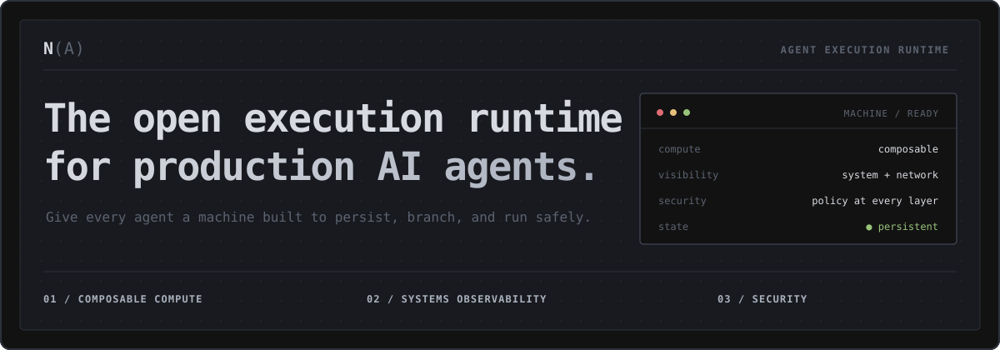

  

  <a href="https://ns.rocks"> <strong>Website</strong></a>
  &nbsp;&nbsp;·&nbsp;&nbsp;
  <a href="https://docs.ns.rocks"> <strong>Docs</strong></a>
  &nbsp;&nbsp;·&nbsp;&nbsp;
  <a href="https://ns.rocks/#waitlist"> <strong>Join the waitlist</strong></a>
  &nbsp;&nbsp;·&nbsp;&nbsp;
  <a href="https://discord.gg/nullspace"> <strong>Discord</strong></a>
  &nbsp;&nbsp;·&nbsp;&nbsp;
  <a href="https://github.com/ns-rocks/nullspace/blob/main/LICENSE"> <strong>Apache-2.0</strong></a>

 

<table>
  <tr>
    <td width="33%" valign="top">
      01 / COMPUTE
      <h3>Composable by default</h3>
      
Give each agent a persistent machine with the right CPU, memory, GPU, tools, and isolation model. Create, hibernate, resume, and fork it through one machine API.

    </td>
    <td width="33%" valign="top">
      02 / OBSERVABILITY
      <h3>See the whole system</h3>
      
Understand what an agent actually does across processes, resources, filesystems, and networks—not only model calls and application traces.

    </td>
    <td width="33%" valign="top">
      03 / SECURITY
      <h3>Defense in depth</h3>
      
Treat agent code as untrusted. Isolate workloads, broker credentials without exposing them, constrain egress with firewalls and network policy, and enforce resource and filesystem boundaries.

    </td>
  </tr>
</table>

## Start here

<table>
  <tr>
    <td width="50%" valign="top">
      <a href="https://docs.ns.rocks/quickstarts/first-machine"><strong>01 / Run your first machine →</strong></a>
       Create a hosted machine and execute code in under five minutes.
    </td>
    <td width="50%" valign="top">
      <a href="https://docs.ns.rocks/agents/bring-your-own-agent"><strong>02 / Bring your own agent →</strong></a>
       Run the agent or framework you already use on the machine it needs.
    </td>
  </tr>
  <tr>
    <td width="50%" valign="top">
      <a href="https://docs.ns.rocks/quickstarts/self-hosted-single-host"><strong>03 / Self-host Nullspace →</strong></a>
       Install the open runtime on one Ubuntu/KVM host.
    </td>
    <td width="50%" valign="top">
      <a href="https://docs.ns.rocks/reference/clients"><strong>04 / Choose a client →</strong></a>
       Build with Python, TypeScript, the CLI, local MCP, or plain HTTPS.
    </td>
  </tr>
</table>

## Open source is the architecture

> The execution layer is where agents touch your code, data, credentials, and
> infrastructure. You should be able to inspect it, run it on hardware you
> control, and keep running without depending on us.

The Apache-2.0 release will include the public API and protocol contracts,
SDKs, CLI, console, documentation, and the complete single-host control plane
and runtime—not just an open client wrapped around a closed service.

- **The whole execution path.** One repository from public API to guest
  runtime.
- **Runs without us.** Self-host on your own machine with no Nullspace account.
- **Hosting, not licensing.** Our business is operating Nullspace for you, not
  closing the runtime around you.

The public release is being prepared now. Until then,
[read the documentation](https://docs.ns.rocks).

 

---

  <strong>Build on the open execution layer for AI agents.</strong>
    
  <a href="https://ns.rocks/#waitlist"> <strong>Join the waitlist</strong></a>
  &nbsp;&nbsp;·&nbsp;&nbsp;
  <a href="https://discord.gg/nullspace"> Discord</a>
  &nbsp;&nbsp;·&nbsp;&nbsp;
  <a href="https://docs.ns.rocks/examples"> Examples</a>
  &nbsp;&nbsp;·&nbsp;&nbsp;
  <a href="https://ns.rocks/careers"> Careers</a>

